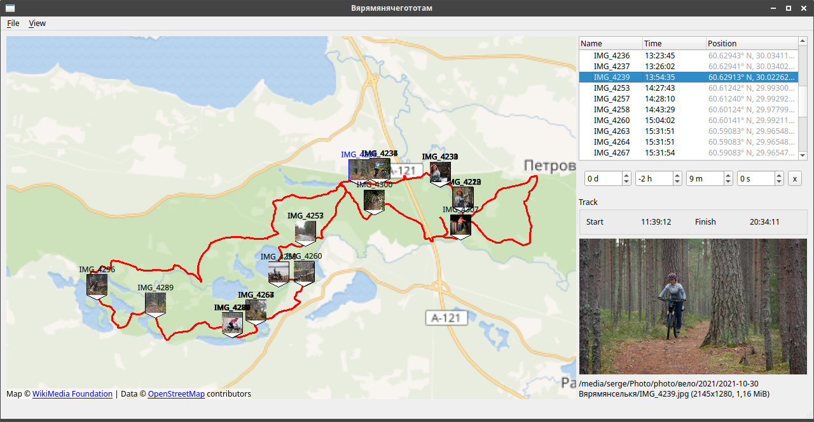

# geotagger

If your photos are not geo-tagged (for example, they are taken with a DSLR camera), you can bind it to the map using the track and time taken.

Geotagger is written in Qt/QML and uses libexif/libjpeg to load and save EXIF data (both are included in the repo).
